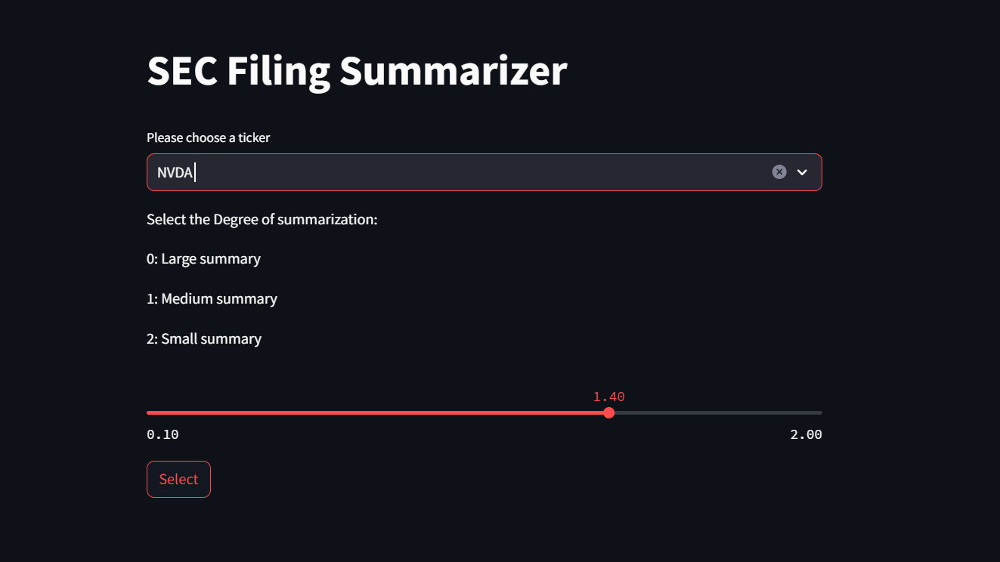
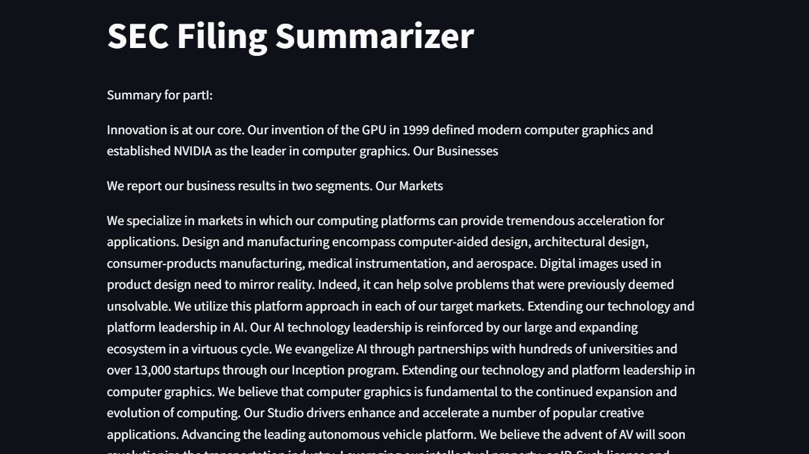
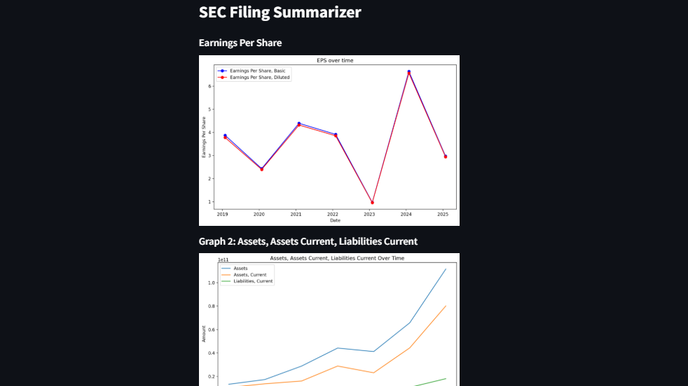

# Financial Report Summarizer 📈

A comprehensive tool for analyzing and summarizing SEC 10-K filings using TF-IDF text summarization techniques. This application extracts, processes, and visualizes financial data from major tech companies (AAPL, GOOG, NVDA, TSLA etc.) directly from the SEC EDGAR database.

<div align="center">
<table>
    <tr>
        <td><br/>Homepage</td>
        <td><br/>Summary</td>
        <td><br/>Graphs</td>
    </tr>
</table>
</div>

## Features

- **Automated SEC Data Scraping**: Fetch 10-K filings directly from SEC EDGAR database
- **Intelligent Text Summarization**: TF-IDF based summarization with customizable compression levels
- **Interactive Web Interface**: Streamlit-powered UI for easy interaction
- **Financial Data Visualization**: Dynamic charts showing key financial metrics over time
- **Multi-Section Analysis**: Process different sections of 10-K filings (Part I, Item 7A, Item 9A)
- **Data Processing Pipeline**: Complete workflow from raw HTML to structured analysis

## Installation

### 1. Clone the repository
   ```bash
   git clone https://github.com/omkarsoak/Financial-Report-Summarizer.git
   cd Financial-Report-Summarizer
   ```

### 2. Install required packages
   ```bash
   pip install streamlit pandas matplotlib nltk requests beautifulsoup4 html2text
   ```

### 3. Download NLTK data (first-time setup)
   ```python
   import nltk
   nltk.download('punkt')
   nltk.download('stopwords')
   ```

##  Usage

### Running the Web Application

```bash
streamlit run src/app.py
```

The application will start on `http://localhost:8501`

### Application Workflow

1. **Select Company**: Choose from AAPL, GOOG, NVDA, or TSLA
2. **Set Summarization Level**: 
   - `0.1-0.9`: Large summary (more detailed)
   - `1.0`: Medium summary (balanced)
   - `1.1-2.0`: Small summary (highly compressed)
3. **Generate Summaries**: Automatic processing of different 10-K sections
4. **View Financial Charts**: Interactive visualizations of key metrics
5. **Navigate**: Use built-in navigation to move between sections

### Data Processing Pipeline

The application follows this data flow:

```
SEC EDGAR → HTML Files → Text Extraction → TF-IDF Processing → Summary Generation → Visualization
```

### Simplified version
A simplified version of the app is available at `src/tf_idf_summarizer_simplified.py`. To run:
```bash
python tf_idf_summarizer_simplified.py --ticker NVDA --n 1.5
```
The output is generated in the directory `./tf-idf-summary`
